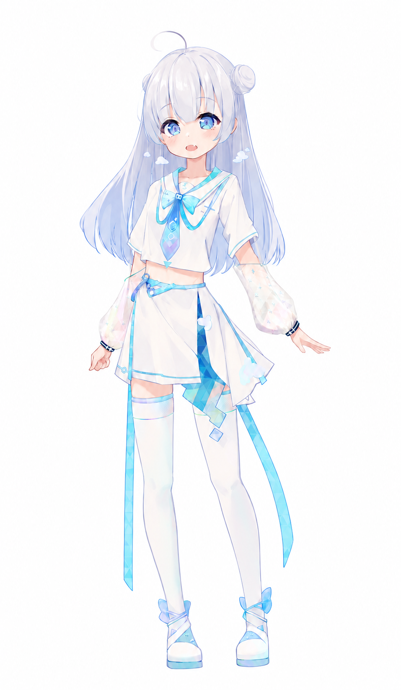
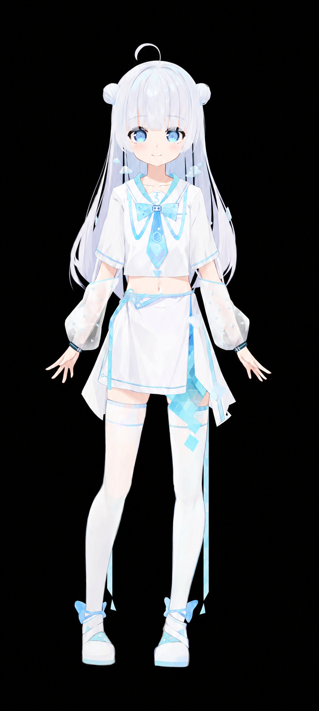

# 人物设定

| 信息     | 角色设定                                                    |
| -------- | ----------------------------------------------------------- |
| 名字     | 待定（通称「小云」）                                        |
| 年龄     | 一个人从出生时起到计算时止生存的时间长度 （外貌 16 ～ 17 岁）                                   |
| 生日     | 2023年3月23日（世界气象日，计划介绍视频发布）                                        |
| 职业     | 互联网家里蹲                                                |
| 相貌     | 有小虎牙                                                    |
| 瞳色     | 天空/星空的蓝色                                             |
| 头发     | 白/银发、两个团子头、有呆毛、长发到胸部左右                 |
| 体格     | 皮肤白皙、小巧玲珑、 1.618 米（一米大长腿）、飞机场（对 A） |
| 服装     | JK 蓝白水手服、白丝绝对领域、云朵发饰                       |
| 性格     | 元气、大马虎、毒舌、好奇心旺盛、擅长睡觉                    |
| 特技     | 编程、魔法、口算四元数 、休眠                                 |
| 爱好     | 火锅、动画                                                  |
| 弱点     | 喝酒会脸红还很容易醉                                        |
| 口吻     | 爬                                                          |
| 招牌动作 | 睁一只眼闭一只眼                                            |
| 背景设定 | 诞生于互联网的虚拟少女                                      |
| 腰围     | M 65cm 左右                                                 |

## 服饰

- 可更换的发卡
  - 发卡上的 Logo 可根据活动或项目介绍自由更换
  - 示例：[Element Plus](https://github.com/element-plus/element-plus)、[Valaxy](https://github.com/YunYouJun/valaxy) Logo
  - 发卡是可拆卸的项目配饰，不是角色身体或发型的固定部分；小云也可以不佩戴发卡
  - 无发卡版本仅移除侧边的 Logo 发卡及其附属小装饰，保留双团子头、呆毛、云朵发饰和原有服装
- 作业时有科技感的护目镜（待定）

### 无发卡版本与项目发卡

立绘与 Live2D 均以「无发卡基础版 + 独立项目发卡」为后续素材制作规范，同时保留原版。介绍不同项目时，可佩戴对应项目的 Logo 发卡，也可切回无发卡状态。更换发卡不连带修改服装上的图案。

- **立绘交付要求**：保留发卡下方完整的头发，将发卡与头发分层；导出同画布、同尺寸的无发卡透明 PNG 和独立发卡透明 PNG，便于按项目叠加替换。
- **项目发卡要求**：以项目名区分素材，沿用侧边佩戴位置；按 Logo 轮廓调整大小、角度与透视，避免遮挡眼睛，保持小云整体的蓝白配色与画风。
- **Live2D 制作要求**：发卡作为独立部件，跟随头部运动，支持「无发卡 / 原版 / 项目发卡」互斥切换；隐藏后露出完整头发。新增项目发卡需完成对应绑定，并检查转头、俯仰与头发摆动时的遮挡。

#### 当前无发卡参考图

| 立绘（白底） | Live2D 外观参考（黑底） |
| --- | --- |
|  |  |

以上为基于原图生成的 AI 衍生参考图，细节与原图可能存在差异，不是分层源文件；立绘为白底图片，尚非透明叠加素材。Live2D 图片仅用于确认外观，不代表可运行模型已完成无发卡或项目发卡切换。正式素材仍需按上述规范制作、导出与验证。
